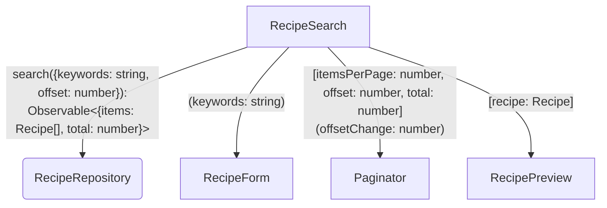

## Diagram



### Legend
- Square corners are Angular components
- Round corners are Angular services
- Text in arrows like `methodName({param: type}): returnType` are method signatures
- Text in square brackets like `[input: type]` are Angular inputs
- Text in round brackets like `(output: type)` are Angular outputs

## Tests

### Load all recipes initially

- Provide a `RecipeRepositoryFake` implementation for `RecipeRepository`.
- Render `RecipeSearch`.
- When app is loaded, the 5 recipes are loaded.

### Filter recipes by keywords

- Provide a `RecipeRepositoryFake` implementation for `RecipeRepository`.
- Render `RecipeSearch`.
- User types "burger" in the search box.
- The recipes are filtered by the keyword "burger".

### Paginator buttons

#### Next page button
- Render `Paginator` with `itemsPerPage: 5`, `offset: 0`, and `total: 7`.
- User clicks on the next page button.
- `offsetChange` event is emitted with `5`.

#### Previous page button
- Render `Paginator` with `itemsPerPage: 5`, `offset: 5`, and `total: 7`.
- User clicks on the previous page button.
- `offsetChange` event is emitted with `0`.

### Previous button is disabled
- Render `Paginator` with `itemsPerPage: 5`, `offset: 0`, and `total: 7`.
- Previous button is disabled.

### Next button is disabled
- Render `Paginator` with `itemsPerPage: 5`, `offset: 5`, and `total: 7`.
- Next button is disabled.

### Paginate recipes

- Provide a `RecipeRepositoryFake` implementation for `RecipeRepository`.
- Render `RecipeSearch`.
- User clicks on the next page button.
- The next 5 recipes are loaded.

### Reset pages when keywords change

- Provide a `RecipeRepositoryFake` implementation for `RecipeRepository`.
- Render `RecipeSearch`.
- User clicks on the next page button.
- User types "burger" in the search box.
- The recipes are filtered by the keyword "burger".
- The previous page button is disabled.

## Examples

### Test Example

```ts
import { ComponentFixtureAutoDetect } from '@angular/core/testing';
import { render, screen } from '@testing-library/angular';
import { RecipeSearchComponent } from './recipe-search.component';
import {
  provideRecipeRepositoryFake,
  RecipeRepositoryFake,
} from './recipe-repository.fake';
import { recipeMother } from '../testing/recipe.mother';

describe(RecipeSearchComponent.name, () => {
  it('should search recipes without filtering', async () => {
    const { getRecipeNames } = await renderComponent();

    expect(getRecipeNames()).toEqual(['Burger', 'Salad']);
  });

  async function renderComponent() {
    const { fixture } = await render(RecipeSearchComponent, {
      providers: [
        provideRecipeRepositoryFake(),
        { provide: ComponentFixtureAutoDetect, useValue: true },
      ],
      configureTestBed(testBed) {
        testBed
          .inject(RecipeRepositoryFake)
          .setRecipes([
            recipeMother.withBasicInfo('Burger').build(),
            recipeMother.withBasicInfo('Salad').build(),
          ]);
      },
    });

    await fixture.whenStable();

    return {
      getRecipeNames() {
        return screen.queryAllByRole('heading').map((el) => el.textContent);
      },
    };
  }
});
```